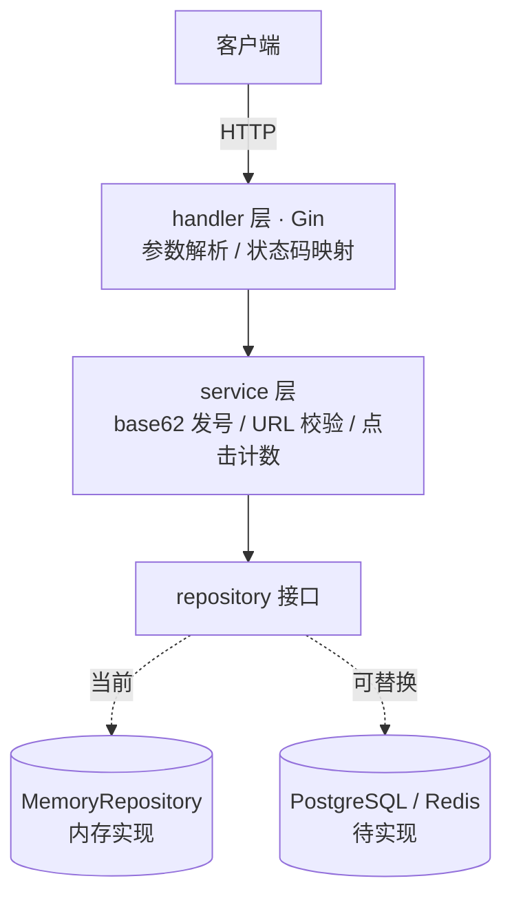

# shortlink · 短链接服务

[](https://github.com/dixiaodixiao/shortlink/actions/workflows/ci.yml)
[](https://go.dev/)

一个用 **Go + Gin** 实现的短链接服务。领域简单，但在**发号编码、分层架构、可测试性、安全与可观测性**上按生产级标准打磨，可作为后端工程能力的展示项目。

> 本项目全程使用 **Claude Code** 协作开发，完整走通「设计 → 骨架 → 测试驱动开发 → AI 代码审查 → 修复 → CI/CD → 文档」流程。详见文末[开发流程复盘](#用-claude-code-协作开发的复盘)。

## 功能

- 长链接 → 短码，短码 302 重定向回原始链接
- 点击计数
- URL 合法性校验（仅允许 http/https，拒绝 `javascript:` 等危险协议）
- 环境变量配置、优雅关闭、HTTP 超时防护

## 架构

严格三层，依赖单向向下，每层均可独立测试：



存储层面向 `LinkRepository` 接口编程，内存实现与未来的 Postgres/Redis 实现可无缝替换（依赖倒置）。完整设计见 [`DESIGN.md`](./DESIGN.md)。

## 快速开始

### 本地运行

```bash
go run ./cmd/server            # 默认监听 :8080
# 或指定端口
PORT=8081 go run ./cmd/server
```

### Docker

```bash
docker build -t shortlink .
docker run -p 8080:8080 shortlink
```

### 环境变量

| 变量 | 默认值 | 说明 |
|------|--------|------|
| `PORT` | `8080` | 监听端口 |
| `BASE_URL` | `http://localhost:${PORT}` | 拼接返回短链的前缀，未设时由 PORT 派生 |
| `GIN_MODE` | `debug` | 设为 `release` 关闭调试日志 |

## API

| 方法 | 路径 | 说明 |
|------|------|------|
| `POST` | `/api/links` | 创建短链 |
| `GET` | `/{code}` | 302 重定向到原始链接 |
| `GET` | `/api/links/{code}` | 查询短链详情（含点击数） |
| `GET` | `/healthz` | 健康检查 |

**创建短链**

```bash
curl -X POST http://localhost:8080/api/links \
  -H 'Content-Type: application/json' \
  -d '{"url":"https://www.anthropic.com/news"}'
# → 201
# {"code":"1","short_url":"http://localhost:8080/1"}
```

**访问短码**

```bash
curl -i http://localhost:8080/1
# → 302 Found
# Location: https://www.anthropic.com/news
```

**查询详情**

```bash
curl http://localhost:8080/api/links/1
# → 200
# {"code":"1","original_url":"https://www.anthropic.com/news","click_count":1,"created_at":"..."}
```

## 测试

```bash
go test ./...                                          # 全部测试
go test ./internal/service/ -run TestEncodeBase62 -v   # 单个测试
go test -race ./...                                    # 竞争检测（需 cgo/gcc；CI 中执行）
```

## 设计亮点

- **发号编码**：短码 = `base62(数据库自增 ID)`，短、无碰撞、可演进为雪花算法 / 号段模式（分布式发号）。
- **短码规范化**：一个链接只对应唯一有效短码，`/01`、`/001` 等非规范写法一律 404，避免多码指向同一资源。
- **溢出防护**：`DecodeBase62` 对超长短码做 uint64 溢出检测，拒绝而非静默回绕。
- **生产级 HTTP**：显式 `http.Server` 设读写/空闲超时（防 Slowloris），监听信号做优雅关闭。

## 项目结构

```
cmd/server/       程序入口，依赖装配
internal/handler/ HTTP 层（Gin）与路由
internal/service/ 业务逻辑：base62 编解码、URL 校验、点击计数
internal/repository/ 存储接口与内存实现
internal/model/   领域模型
```

## 用 Claude Code 协作开发的复盘

本项目刻意演示「人主导、AI 执行、人把关」的现代 AI 辅助开发流程：

1. **规格先行**：先写 `DESIGN.md` 定清架构与 API，再让 AI 编码——规格越清晰，产出质量越高。
2. **测试驱动**：每个功能先写测试（红）再实现（绿），测试即 AI 产出的验收标准。
3. **AI 代码审查**：用 `/code-review` 对 AI 自己的产出做高强度审查，查出 6 处真实问题（整数溢出、缺少超时、短码规范化等），再逐个 TDD 修复。
4. **工程闭环**：语义化提交历史、CI（vet + 竞争检测 + 覆盖率 + 镜像构建）、容器化、项目规约 `CLAUDE.md` 一应俱全。

核心不是「AI 帮我写了代码」，而是「我用规格、测试和审查驾驭 AI，对每一行产出负责」。
